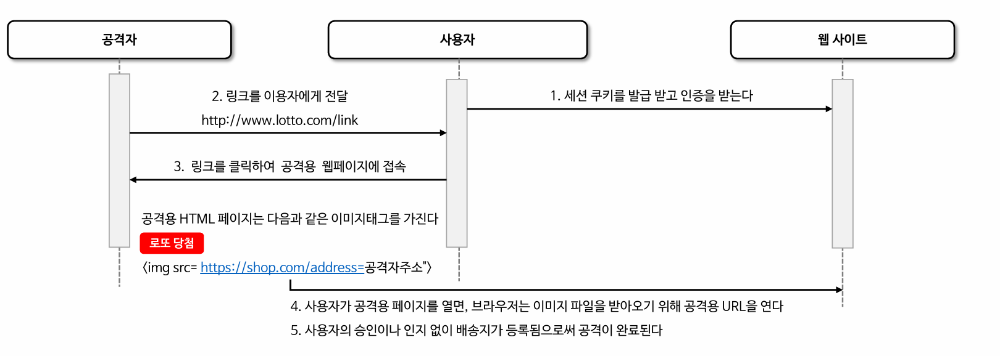

악용 보호
== 
## CORS(Cross Site Resource Sharing)
- 교차 출처 리소스 공유
- 기본적으로 웹에서는 `Same Origin Policy` 라는 웹 보안 정책을 준수하고 있다.
- 이는, 교차 출처일 때 리소스의 접근을 거부하는 정책이다.
- 교차 출처임에도 접근을 허용하고자 할 때 CORS를 사용한다. 결국 CORS 라는 개념은 다른 출처에 리소스에 접근할 수 있도록 허가를 구하는 개념이다.
- 브라우저에 구현된 방식을 통해서 출처가 비교된다.


- 출처는 Host, Port, Protocol이 동일하면 같은 출처이다.
- XMLHttpRequest와 Fetch API는 동일 출처 정책을 따르기 때문에이 API를 사용하는 웹 애
  플리케이션은 자신의 출처와 동일한 리소스만 불러올 수 있으며, 다른 출처의 리소스를 불러오
  려면 그 출처에서 올바른 CORS 헤더를 포함한 응답을 반환해야 한다.


### Cors 종류
- Simple Request
  - Prfilght 요청이 없이 서버에 본 요청을 한 후 서버의 응답 헤더에 Access-Control-Allow-Origin 같은 값을 전송하면 브라우저가 서로 비교. 
  - CORS 정책 위반 여부를 검사한다. 
  - 단, 다음과 같은 조건이 성립되어야 Simple Request 방식으로 처리한다.
    - GET, POST, HEAD 메서드 중 하나이어야 한다.
    - 헤더가 Accept, Accept-Language, Content-Length, Content-Type, DPR, DownLink 등의 간단한 헤더일 경우에만 가능.
    - Content-Type은 application/x-www-formurlencoded, multipart/form-data, text/plain. 즉, 폼이나 간단한 텍스트를 주고 받을 경우에 한해서 동작.
- Preflight Request
  - 본 요청을 보내기 이전에 Options Method를 통해 예비 요청을 보낸다.
  - Preflight Request는 본 요청을 보내기 이전 스스로 안전한 요청인지 확인하는 것이다.
  - Access-Control-Request-XXX를 만족할 때 본 요청을 전송한다.
  - 클라이언트가 전송할 때 자신이 보낼 본 요청의 Content-Type이나 헤더 등을 지정해서 Options 요청을 보낼 수 있다.
  - 200번대 정상처리일 경우에만 본 요청 전송.

### Access-Control-Allow-* 헤더
- Access-Control-Allow-Origin
  - 허용할 교차 출처의 리소스 지정.
  - ex) *, http://security.io
- Access-Control-Allow-Methods
  - 허용할 요청 메서드를 나타낸다.
  - Preflight request에 응답으로 보낸다.
- Access-Control-Allow-Headers
  - 허용할 헤더를 지정한다.
- Access-Control-Allow-Credentials
  - 실제 요청 정보에 쿠키, 인증 정보(Authorization 헤더) 등의 자격 증명을 포함할 수 있는지 여부를 지정.
- Access-Control-Max-Age
  - preflight 요청 결과를 캐싱할 수 있는 시간 지정.

### cors(), CorsFilter
- CORS의 사전 요청에는 쿠키가 포함되어있지 않기 때문에 Spring Security의 주요 필터 이전에 처리되어야한다.
- Security가 먼저 처리가 된다면 인증되지 않았다고 거부할 수 있기 때문.
- 그래서 CorsFilter는 주요 필터 이전에 호출된다.

````java
@Bean
public CorsConfigurationSource corsConfigurationSource() {
   CorsConfiguration configuration = new CorsConfiguration();
   configuration.addAllowedOrigin("https://example.com"));
   configuration.addAllowedMethod("GET","POST"));
   configuration.setAllowCredentials(true);
   UrlBasedCorsConfigurationSource source = new UrlBasedCorsConfigurationSource();
   source.registerCorsConfiguration("/**", configuration);
   return source;
}
````
- CorsConfiguration으로 Access-Control-Allow-xxx 에 대한 설정을 수행할 수 있다.
- UrlBasedCorsConfigurationSource 를 통해 Cors 필터가 적용할 url 패턴을 지정할 수 있다. 

**필터 호출**

시나리오 1. Preflight Request일 경우

1. 지정한 ConfigurationSource에서 CorsConfiguration 객체를 조회한다.
  - UrlBaseConfigurationSource에서 현재 request Path에 대한 정보를 조회한다.
  - path 정보에 맞는 CorsConfiguration을 Map에서 조회한다.
2. 요청 Origin이 서버의 Origin과 동일한지 확인한다.
  - 프로토콜, 호스트, 포트를 비교한다.
  - 일치한다면 올바른 Cors 요청이지만, 그렇지 않다면 올바르지 않은 Cors 요청
3. 요청 메서드가 Options 이면서, Origin 헤더가 존재하고, Access-Control-Request-Method가 존재한다면 Preflight Request이다.
4. Access-Control-Request-Method와 CorsConfiguration 에서 허용한 메서드가 일치하지 않으면 그 즉시 요청을 거절한다.
5. 응답으로 Access-Control-Allow-xxx를 설정한 다음 응답을 보낸다.
6. 본 요청이 아니기 때문에 다음 필터를 호출하지 않고 종료한다.
7. 이후 본 요청이 처리된다.


시나리오 2. 본 요청을 처리할 때
1. 지정한 ConfigurationSource에서 CorsConfiguration 객체를 조회한다.
  - UrlBaseConfigurationSource에서 현재 request Path에 대한 정보를 조회한다.
  - path 정보에 맞는 CorsConfiguration을 Map에서 조회한다.
2. 요청 Origin이 서버의 Origin과 동일한지 확인한다.
  - 프로토콜, 호스트, 포트를 비교한다.
  - 일치한다면 올바른 Cors 요청이지만, 그렇지 않다면 올바르지 않은 Cors 요청
3. CorsConfiguration에서 허용된 Origin 요청인지 확인한다.
4. Origin 일치하지 않다면, 그 즉시 요청을 거절한다.
5. CorsConfiguration에서 허용된 Method, Header가 아니라면 그 즉시 요청을 거절한다.
6. response Header에 Access-Control-Allow-XXX을 추가한다.
7. 모든 내부 처리가 완료됐다면 다음 필터를 호출한다.
8. 본 요청 처리가 완료된다.


시나리오 3. Simple Request 인 경우.
- Simple Request는 Preflight Request를 보내지 않고 본 요청에 대한 응답으로 Access-Control-Allow-XXx를 브라우저에서 검증한 뒤 사용자에게 응답한다.
  - 조건이 만족해야한다.
  - Content-Type이 form 방식에서 사용하는 두가지(application/x-www-form-urlencoded, multipart/form-data, text-plain)
  - GET, HEAD, POST 중 하나의 메서드
  - 간단한 헤더만 전송할 경우.
- 본 요청만 전송된다.

## Cross Site Request Forgery
- 사이트 간 요청 위조
- 웹 보안 취약점으로 공격자가 사용자로 하여금 원치 않은 작업을 수행하도록 만드는 기법을 말한다.
- 브라우저에 저장되어있는 세션 쿠키, 기타 인증 정보를 이용하여 사용자가 의도치 않은 요청을 서버에 전송하도록 유도하는 기법

**진행 과정**


- 웹 사이트에 인증을 성공해 세션 쿠키나 인증 정보를 취득한다.
- 공격자는 사용자에게 공격용 웹 페이지의 링크를 전달한다.
- 그 페이지안에서 웹 사이트의 민감한 요청을 보내도록 만든다.
- 사용자의 인지 없이 웹 사이트에 요청이 나가는 것으로 공격이 완료.

### 기능 활성화 - http.csrf()
- HttpSecurity의 csrf 메서드로 설정한다.
- 서버에 의해 토큰이 생성되어 세션에 저장되고 폼을 통해 서버로 전송되는 모든 요청에 csrf 토큰이 포함되어야한다.
- 서버에서 해당 토큰을 가지고 검증을 수행한다.
- 안전한 HTTP 메서드 GET, HEAD, OPTIONS, TRACE 같은 안전 메서드는 csrf 토큰을 확인하지 않고 변경 메서드의 한해서 csrf 토큰 검사를 수행한다.
- 반드시 요청 csrf 파라미터와 토큰이 일치해야 요청이 처리된다.
- 일부분의 url에 대해서만 적용하고자 한다면, ignoringRequestMatchers()로 지정한다.

**동작**
1. 매 요청에 CsrfFfilter가 기본적으로 동작한다.
2. 지연된 토큰 생성을 지원해주기 위해서, Supplier를 사용한다.
3. request 객체에 csrftoken 생성관련 객체를 바인딩한다.
4. GET, HEAD, OPTION, TRACE 와 같은 단순 조회 목적의 요청의 경우 csrf 토큰을 따로 클라이언트에 보내지 않고 다음 필터를 호출한다.
   - 이런 이유 때문에 실제 csrf 토큰을 생성하지 않고 지연된 토큰 생성을 진행하는 것 같다.
5. 단 시큐리티 기본 로그인 페이지의 경우 csrf 토큰이 삽입된다.
6. Post 요청 같은 데이터 삽입 요청이 오면 CsrfToken을 조회한다.
7. csrf 토큰이 일치하지 않으면 거절된다.


## CSRF 토큰 유지 - CsrfTokenRepository
- CsrfToken은 CsrfTokenRepsoitory를 사용하여 영속화한다.
  - HttpSessionCsrfTokenRepository와 CookieCsrfTokenRepository 가 존재한다.
  - 즉, Session 혹은 Cookie에 토큰을 저장하도록 지정할 수 있다.
  - 기본 값은 HttpSessionCsrfTokenRepository를 사용한다.
- HttpSessionCsrfTokenRepository는 csrf 검증을 위해 csrf 토큰 값을 읽어들일 때 다음 두 곳에서 읽어들인다.
  - X-CSRF-TOKEN Http 헤더
  - _csrf 요청 파라미터
- CookieCsrfTokenRepository
  - 두 가지 옵션이 있다. Js에서 쿠키를 읽을 필요가 있을 경우에는 HttpOnly를 false로 설정할 수 있다.
  - HttpOnly는 쿠키를 JavaScript에서 직접 읽을 필요가 있을 때 설정하는 값이다.
  - 기본적으로 XSRF-TOKEN의 이름으로 Cookie를 생성한다.
  - X-XSRF-TOKEN Http 헤더에서 읽거나 요청 매개변수 _csrf에서 읽는다.
- 둘 다 _csrf 매개변수에서 읽는건 공통적이지만, 쿠키, 세션에 따라 X-CSRF-TOKEN, X-XSRF-TOKEN 이름이 다르다. 

## CsrfTokenRequestHandler
- 세션이나 쿠키에 저장된 CsrfToken과 클라이언트의 요청 CsrfToken 값이 일치하는지 비교하고 이를 처리하는 클래스.
- XorCsrfRequestAttributeHandler, CsrfTokenRequestAttributeHandler 를 제공한다.
- 기본 값은 XorCsrfRequestAttributeHandler가 등록된다.
- _csrf 및 CsrfToken.class.getName() 명으로 HttpRequest에 저장하고 CsrfToken을 꺼내어 참조가능하다.
- 토큰 값을 요청 헤더나 요청 매개변수 중 하나로부터 토큰의 유효성 비교 및 검증을 해결한다.
- 매 요청마다 CSRF 토큰 값에 난수를 인코딩하여 변경한 CsrfToken이 반환 되도록 보장한다. 원본 토큰은 세션에 저장한다.
- 헤더 값이나 요청 매개변수로 전달된 인코딩 된 토큰은 원본 토큰을 얻기 위해 디코딩된다. 그 이후 다음 세션 혹은 쿠키게 저장된 영구적인 CsrfToken과 비교된다.

## Csrf 토큰 지연 로딩
- 스프링 시큐리티에서는 Supplier를 활용해서 필요할 경우에 실제 데이터를 조회하는 식으로 각종 인증 정보를 로딩을 지연하는 전략을 채택했다.
- 매 요청마다 CsrfToken을 로드할 필요가 없어 성능 향상이 가능하다.
  - I/O 작업이 줄어서 그런것 같다.
- 안전하지 않은 Http 메서드를 활용할 때 이외의 경우에는 지연 로딩을 수행한다.
- 지연된 토큰을 사용하는 것으로 성능을 향상한다.


**CsrfFilter 동작**
- 먼저 DeferredCsrfToken을 생성한다. 
  - CsrfToken을 생성하는 역할을 담당하는 현재 CsrfTokenRepository, HttpServletRequest, HttpServletResponse를 저장하고 있다.
  - 실제 토큰을 생성하는건 필요할 때 생성한다.
- 이를 CsrfToken 클래스의 getName(), _csrf의 key 값으로 Request 객체에 저장한다. 
- 안전한 HTTP 요청인 GET 방식의 경우 CSRF 기능이 동작하지 않는다.
  - 이전 지연된 CsrfToken에 대한 호출을 아무것도 하지 않는다.
- CSRF 적용 요청일 때, DefferedCsrfToken에서 실제 Token을 조회한다.
  - DefferedCsrfToken 에서 다음과 같은 작업을 수행한다.
    - 현재 session에서 csrfToken을 조회한다.
    - 없다면, CsrfRepository를 통해 현재 request에 uuid 기반의 csrf 토큰을 발급하고 세션에 해당 token을 저장한다.
- 이후 클라이언트에서 전달한 csrf 토큰과 현재 세션에 저장되어 있는 csrf 토큰을 비교한다.
  - headerName, parameterName으로 조회한 결과를 반환.
  - 실제 토큰과 전달 받은 csrf 토큰이 일치하는지 확인한 후 이후 작업을 처리한다.
    - 클라이언트가 전달하는 토큰은 인코딩된 값이기 때문에 디코딩을 수행한다.
    - 일치하지 않는 경우, AccessDeniedException이 발생한 것 처럼 accessDeniedHandler를 호출한다.
    - 일치하는 경우, 다음 필터를 호출한다.

- CookieRepository를 사용할 경우에는 쿠키에 저장된다는 것 이외에 다른 것은 없다.
