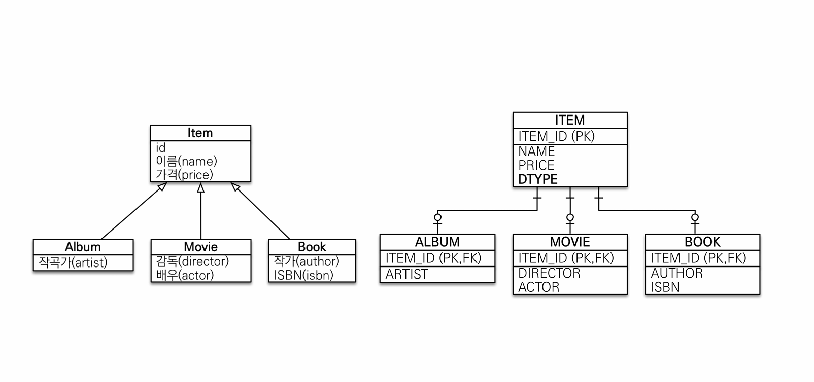
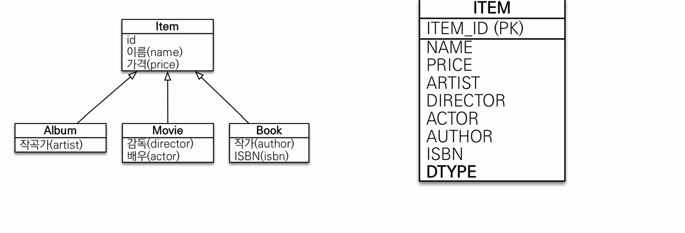
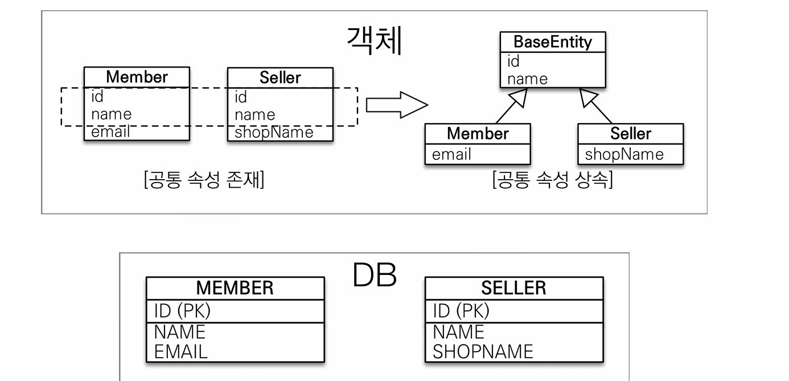

상속관계 매핑
== 
- 관계형 데이터베이스는 상속 관계가 없다.
- 유사하게 구현하기 위해 세가지 방식을 사용한다.
  - 조인 전략
  - 단일 테이블 구성
  - 구현 클래스마다 테이블 구성

상속관계를 지원하기 위한 어노테이션들이 존재한다.
- `@Inheritence`
  - JOINED
  - SINGLE_TABLE
- `@DiscriminatorColumn`
  - 구분 컬럼의 이름을 지정할 수 있다.
- `@DiscriminatorValue`
  - 자식 객체에 지정하는 어노테이션
  - 구분 컬럼에 들어갈 값을 지정한다.

  
### 조인 전략

- 엔터티 각각을 외래키를 활용하여 테이블로 구성
- 장점
  - 테이블이 정규화되어있다.
  - 저장공간을 효율적으로 사용
  - 외래 키를 무결성 제약조건 활용 가능.
- 단점
  - insert 가 두번 발생.
  - 조회 쿼리가 복잡하다.
  - 조인을 사용해야해서 성능이 저하될 수 있다.

### 단일 테이블 구성

- 모든 데이터를 하나의 테이블로 구성
- 어떤 자식 타입의 데이터가 저장됐는지 식별하기 위해 구분 컬럼 사용.
- 장점
  - 조인이 필요없어 조회 성능이 빠르다.
  - 조회 쿼리 단순.
- 단점
  - 반드시 null 인 컬럼이 존재한다.
  - 테이블이 비대해진다.

기본적으로는 조인 전략을 사용한다.

## @MappedSuperclass
- 상속관계 매핑과 전혀 관계 없다.
- 공통 매핑 정보를 제공해주고 싶을 때 사용한다.

