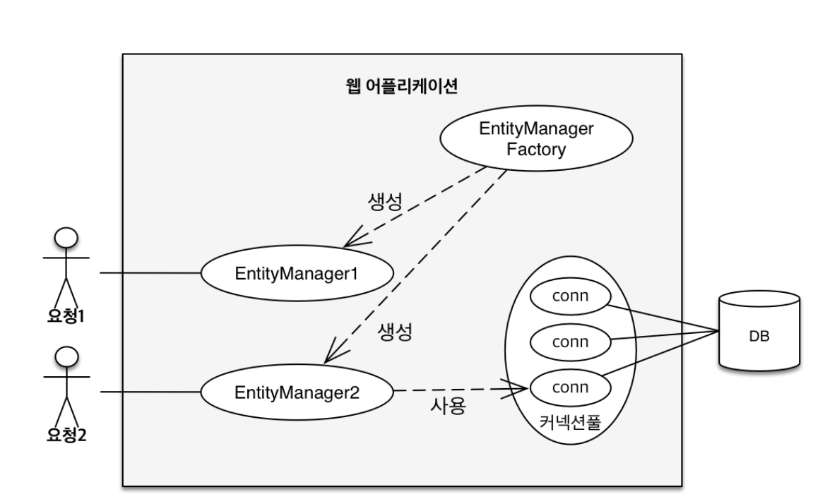

시작
== 
JPA는 EntityManagerFactory를 통해 요청마다 EntityManager를 생성한다.
- EntityManagerFactory는 세션을 생성할 때 마다 하나씩 생성되고 DB 커넥션 풀을 내부적으로 사용한다 그림과 같다.

## 영속성 컨텍스트(Persist Context)
- JPA를 이해하는데 가장 중요한 용어
- "엔터티를 영구 저장하는 환경"
- entityManager.persist(entity)
  - entity 객체를 db에 저장하는 것이 아닌, entity를 영속성 컨텍스트에 저장한다는 의미.

### 엔티티 매니저와 영속성 컨텍스트
- 논리적인 개념.
- 엔티티 매니저를 통해서 영속성 컨텍스트에 접근.

### 엔티티 생명주기
- **비영속**
  - 영속성 컨텍스트와 전혀 관계가 없는 상태.
  - 엔티티 객체를 메모리에 생성한 상태라고 생각하면 된다.
- **영속**
  - 영속성 컨텍스트에 관리되는 상태
  - 반드시 PK 값이 있어야한다.
  - 엔티티 매니저의 persist를 호출하면 영속상태가 된다.
  - 실제 DB에 저장되는 시점은 트랜잭션이 커밋되는 시점에 이뤄진다.
- **준영속**
  - 영속성 컨텍스트에 저장되었다가 분리된 상태
- **삭제**
  - 삭제된 상태

이렇게 영속성 컨텍스트에 관리되는 것으로 얻을 수 있는 이점은 다음과 같다.
- 1차 캐시
  - 엔티티를 영속화 시키면, 조회시 DB로 접근하지 않고 영속성 컨텍스트에서 조회를 한다.
  - 있다면 DB를 접근하지 않고 해당 객체를 반환하고, 없을때 실제 DB에 접근한다.
- 동일성 보장
  - 같은 트랜잭션 내에서 조회한 동일한 엔터티의 대해 동일성을 보장한다.
- 트랜잭션을 지원하는 쓰기 지연
  - 쓰기 지연 SQL 저장소가 존재하고 영속성 컨택스트에 관리되는 엔티티에 대한 insert sql을 모두 저장한다.
  - 트랜잭션이 커밋되는 순간 이전까지 insert를 보내지 않다가 커밋하는 순간 모든 sql을 DB에 보낸다.
- 변경 감지(Dirty Checking)
  - 1차 캐시에 들어온 엔티티의 스냅샷을 함께 1차 캐시에 저장한다.
  - flush 호출 시점에 엔티티와 스냅샷을 비교한 뒤, 다르다면 update 쿼리를 생성해서 db에 보낸다. 
- 지연 로딩(Lazy Loading)

### 플러시
플러시 호출 시 다음과 같은 작업을 거친다.
  - 변경 감지 수행
  - 수정된 엔티티에 대한 쓰기 지연 SQL 저장소에 등록
  - 해당 쿼리들을 실제 DB에 전송
- 영속성 컨텍스트 변경 내용을 데이터베이스에 반영.

### 준영속
- 더 이상 영속성 컨택스트에 의해 관리되지 않는 상태.
- 영속성 컨택스트에서 제공하는 이점을 제공받을 수 없다.

### 호출 방법
- entityManager.flush()
- 트랜잭션 커밋 - 자동 flush()
- jpql 쿼리 실행 - 자동 flush()