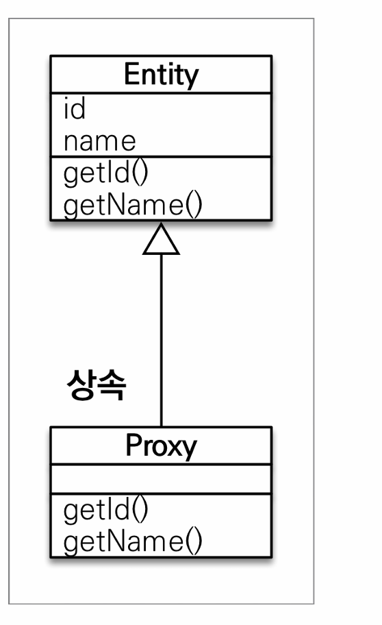
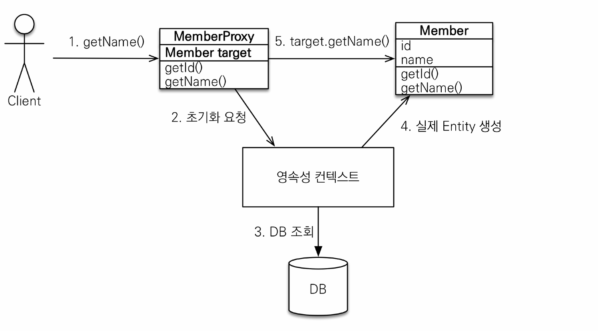

프록시
==
연관관계의 주인인 엔터티는 조회 시 연관된 객체를 Join해서 가지고 온다. 이는 의도된 상황이 아닐 수 있다.

JPA에서는 이를 해결하기 위해 프록시 기술을 활용했다.
- getReference() 메서드를 사용하면 실제 해당 엔터티를 사용하는 시점까지 조회를 미룬다.
- 가짜 엔터티 객체를 반환해서 전달해준다.

### 프록시 특징

- 프록시 객체는 실제 엔터티로 바뀌는게 아니라, 프록시 객체를 통해 실제 엔티티로 접근하는 것이다.
- 원본 엔터티를 상속받은 것이기 때문에 타입 체크시 주의해야한다.
  - 영속성 컨택스트에서 제공하는 동등성 비교를 수행할 수 없다.
- 영속성 컨택스트에 이미 존재하는 엔터티의 경우 해당 객체를 반환하고 프록시를 생성하지 않는다.

### 초기화

- 프록시에 실제 엔티티 내용을 요청한다.
- 실제 엔티티가 생성되어 있지 않기 때문에 영속성 컨택스트 요청한다.
- 영속성 컨택스트가 실제 DB에 조회해서 엔터티 객체를 생성한다.
- 프록시 객체는 실제 엔터티 객체의 참조를 target 변수에 보관한다.
- 준영속 상태에서 프록시를 초기화하면 문제가 발생한다.
  - 준영속 상태가 되면 더 이상 영속성 컨택스트에 의해 관리되지 않기 때문에 예외가 발생한다.

## 지연 로딩, 즉시 로딩
- 원하지 않는 조인을 방지하기 위해 JPA는 지연 로딩을 지원한다.
- 프록시를 사용해 실제 연관 객체를 조회할 때 실제 엔터티를 조회하는 것이다.
- 그렇지 않을 때는 FetchType.EAGER를 사용해서 즉시 조회할 수 있다.

### 즉시로딩 주의
- 가급적 지연 로딩만 사용하자.
- 즉시 로딩은 JPQL에서 N+1 문제가 일어난다.
- `@ManyToOne` `@OneToOne`은 기본이 즉시 로딩.
  - LAZY로 설정하자.
- `@OneToMany`, `@ManyToMany`는 기본이 지연 로딩.

패치 조인을 사용하거나 엔터티 그래프, 배치 사이즈로 해결할 수 있다.

## 영속성 전이 CASCADE
- 외래키 속성 중, CASCADE 속성이 존재한다. 
  - 자식 테이블에서 참조하고 있는 부보 테이블의 row가 삭제됐을 때 어떻게 설정할 것인가?
  - CASCADE라는 속성이 존재하는 데 해당 부분이다.
- 단일 엔터티의 종속적일 경우에만 사용하자.

## 고아 객체
- 부모 객체와 연관관계가 해제된 자식 객체를 자동으로 삭제한다.
- orphanRemoval 옵션.
- 참조하는 곳에 하나일 때만 사용하자.

### 영속성 전이 + 고아 객체
- CascadeType.ALL + orphanRemovel=true
- 부모 엔티티를 통해 자식의 생명 주기를 관리할 수 있다.

모든 연관관계를 지연 로딩으로