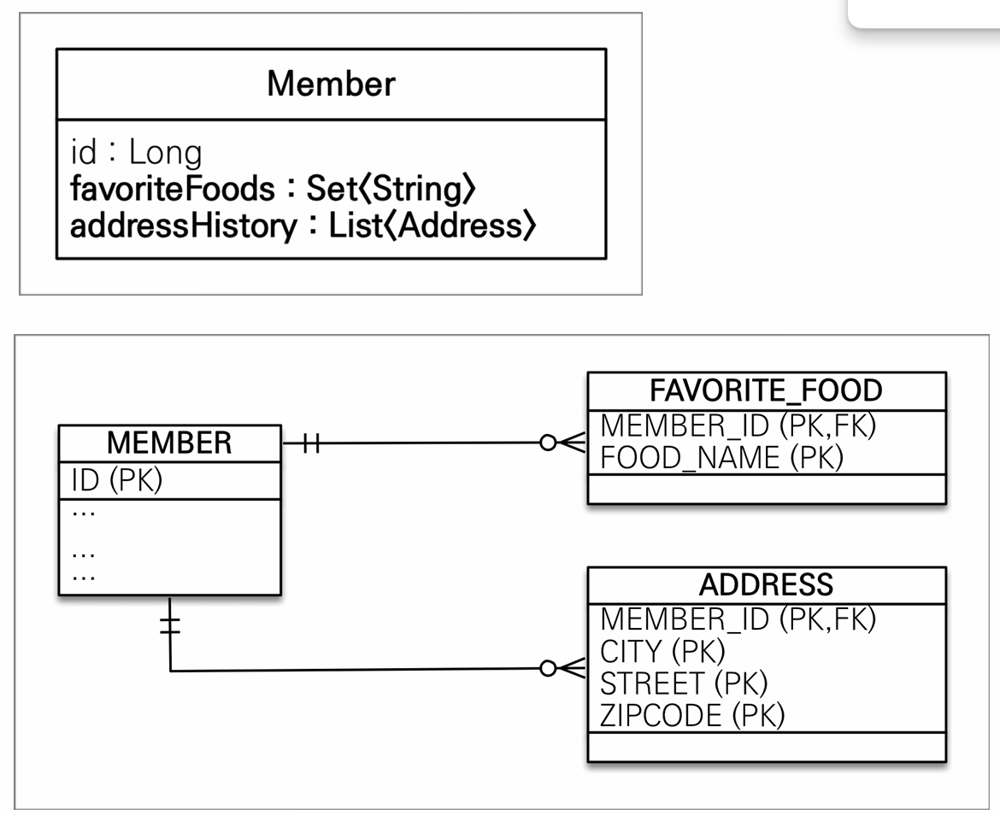

값 타입
==
### JPA 데이터 타입
- 엔터티 타입
  - @Entity로 정의하는 객체
  - 데이터가 변해도 식별자로 지속해서 추적 가능.
- 값 타입
  - int, integer, String 처럼 값으로 사용하는 자바 기본 타입이나 객체
  - 식별자가 없고 값만 있으므로 변경시 추적 불가.

### 값 타입
- **기본 값 타입**
  - 자바 기본 타입
  - 래퍼 클래스
  - String
- **임베디드 타입**
- **컬렉션 값 타입**

### 기본 값 타입
- 생명주기를 엔터티에 의존한다.
- 값 타입은 절대로 공유하면 안된다.
- 엔터티마다의 고유한 값이기 때문이다.


### 임베디드 타입
- 새로운 값 타입을 직접 정의할 수 있다.
- JPA에서는 임베디드 타입이라고 한다.


- 그림처럼 재사용 가능한 타입으로 만들고 사용할 수 있다.
- DB에 저장될 때는 기존과 같이 저장된다. 

### 임베디드 타입과 테이블
- 임베디드 타입은 엔터티의 값이다.
- 임베디드 타입을 사용하기 전, 후 테이블은 같다.
- 객체, 테이블을 세밀하게 매핑하는 것이 가능해지도록 한다.

### 값 타입
- 복잡한 객체 세상을 조금이라도 단순화하려고 만든 개념이다.
- 값 타입은 안전하게 다룰 수 있어야한다.
- 임베디드 타입(인스턴스)를 여러 엔티티에서 공유하면 굉장히 위험하다.
```java
public class Main {
  public static void main(String[] args) {
    EntityManagerFactory factory = Persistence.createEntityManagerFactory("org.hibernate.tutorial.jpa");
    EntityManager entityManager = factory.createEntityManager();
    EntityTransaction transaction = entityManager.getTransaction();

    transaction.begin();
    try {
      Period workPeriod = new Period(LocalDateTime.now(), LocalDateTime.now());

      User user1 = new User();
      user1.setWorkPeriod(workPeriod);

      User user2 = new User();
      user2.setWorkPeriod(workPeriod);

      entityManager.persist(user1);
      entityManager.persist(user2);
      entityManager.flush();

      workPeriod.setEndDateTime(LocalDateTime.now());

      transaction.commit();


    } catch (Exception e) {
      e.printStackTrace();
      transaction.rollback();
    }
    entityManager.close();
    factory.close();
  }
}
```
- 임베디드 타입의 값 타입을 공유하고 있다.
- 이 임베디드 타입을 예상치도 못한 update 쿼리 2번이 나간다.
- 임베디드 타입을 공유하고 싶으면 다른 참조 값을 가지도록 만들어야한다.
- 아무리 조심해도 공유 참조를 피할 수 없다.

### 불변 객체
- 객체 타입을 수정할 수 없다 불변 객체로 설계하면 이를 원천적으로 차단 가능.
- setter를 만들지 않고, 생성자로만 값을 설정한다.

## 값 타입 컬렉션
- 값 타입을 컬렉션에 담아서 사용하는 것을 말한다.
- @ElementCollection, @CollectionTable을 사용한다.
- 엔터티의 생명주기가 같기 때문에 엔터티가 삭제되면 모든 값 타입 컬렉션도 삭제된다.

### 주의 사항
- 값 타입 컬렉션에 변경 사항이 발생하면 주인 엔터티와 연관된 모든 데이터를 삭제하고 컬렉션에 있는 값을 다시 저장한다.
- 엔터티와 달리 식별자 개념이 없다.

### 대안 
- **일대다 관계**로 풀어낸 다음 이 테이블에 값 타입을 사용한다.  
- 영속성 전이 + 고아 객체 제거를 사용해서 값 타입 컬렉션 처럼 사용.

